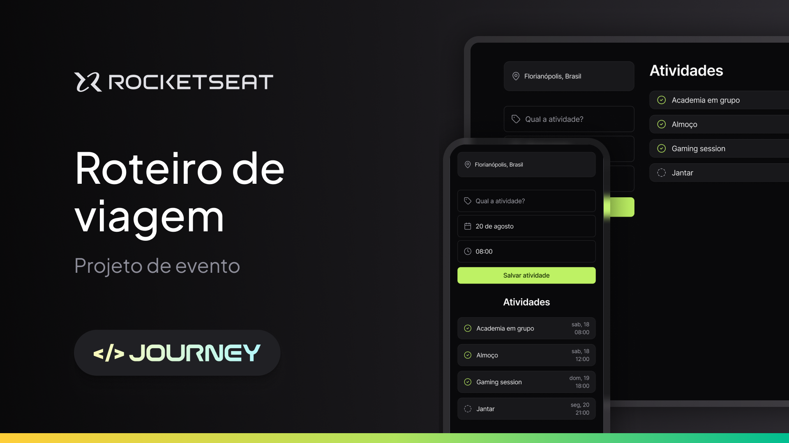

  

API desenvolvida no NLW Journey da Rocketseat - trilha HTML/CSS/JS.

  <a href="#-tecnologias">Tecnologias</a>&nbsp;&nbsp;&nbsp;|&nbsp;&nbsp;&nbsp;
  <a href="#-projeto">Projeto</a>&nbsp;&nbsp;&nbsp;|&nbsp;&nbsp;&nbsp;
  <a href="#-design">Design</a>&nbsp;&nbsp;&nbsp;|&nbsp;&nbsp;&nbsp;
  <a href="#-repositorio">Repositório</a>&nbsp;&nbsp;&nbsp;|&nbsp;&nbsp;&nbsp;
  <a href="#-extra">Extra</a>

 

## 🚀 Tecnologias

Esse projeto foi desenvolvido utilizando as tecnologias:
- HTML.
- CSS.
- JS.

## 💻 Projeto

   

Nesse projeto desenvolvemos uma versão simplificada de um sistema de roteiro de viagem!

## 📚 Design

- [Figma do Projeto](https://www.figma.com/community/file/1392277205162897872/nlw-journey-roteiro-de-viagem).

## 🐙 Repositorio

- Aula 01:
  - [Commit no GitHub](https://github.com/rocketseat-education/nlw-journey-html-css-js/tree/8a4694414413f0daedb6f655470d5a31795191e1).
  - [Código no FrontEditor](https://fronteditor.dev/gists/4d44adff1cd60918651a5cc4fe2a2ef7/view).

- Aula 02:
  - [Commit no GitHub](https://github.com/rocketseat-education/nlw-journey-html-css-js/tree/570045cfc85e43df85a959a800e2cec1dae97570).
  - [Código do FrontEditor](https://fronteditor.dev/gists/e81c751c8d0ca060d4cb20a160e440a9/view).

- Aula 03:
  - [Commit no GitHub](https://github.com/rocketseat-education/nlw-journey-html-css-js/tree/c7b9e22548684e30d8323a2cc51c782775fa5cac).
  - [Código do FrontEditor](https://fronteditor.dev/gists/f7e816e4eace66458fec2356a33d9bad/view).

## 💭 Extra

- [Day.js](https://day.js.org/).